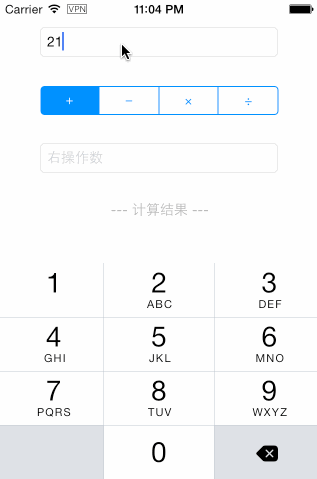

MVVM ARC Demo
============

I writing some MVVM and ARC demo. Very conducive to learning.

Contents
----------

##### Demo_01




`ViewControler.m`
```Objective-C
RAC(_viewModel, leftOperandValue) = self.leftOperandTF.rac_textSignal;
RAC(_viewModel, rightOperandValue) = self.rightOperandTF.rac_textSignal;
RAC(_viewModel, basicOperator) = [self.operationSC rac_newSelectedSegmentIndexChannelWithNilValue:@0];
RAC(self.resultLabel, text) = RACObserve(_viewModel, resultString);
```

`ViewModel.m`
```Objective-C
- (instancetype)init {
    if (self = [super init]) {
        @weakify(self);
        RAC(self, resultString) = [RACSignal combineLatest:@[RACObserve(self, leftOperandValue),RACObserve(self, rightOperandValue), RACObserve(self, basicOperator)] reduce:^id(NSString *v1, NSString *v2){
            @strongify(self);
            if(v1.length > 0 && v2.length > 0) {
                return [self p_calculate];
            } else {
                return nil;
            }
        }];
    }
    return self;
}

- (NSString *)p_calculate {
    NSDecimalNumber *left = [NSDecimalNumber decimalNumberWithString:self.leftOperandValue];
    NSDecimalNumber *right = [NSDecimalNumber decimalNumberWithString:self.rightOperandValue];
    switch (self.basicOperator) {
        case BasicOperatorAdd:
            self.resultString = [left decimalNumberByAdding:right].stringValue;
            break;
        case BasicOperatorSubstract:
            self.resultString = [left decimalNumberBySubtracting:right].stringValue;
            break;
        case BasicOperatorMultiply:
            self.resultString = [left decimalNumberByMultiplyingBy:right].stringValue;
            break;
        case BasicOperatorDivide:
            self.resultString = [left decimalNumberByDividingBy:right].stringValue;
            break;
        default:
            self.resultString = @"未知结果";
    }
    
    return self.resultString;
}
```

Components
----------

* (ReactiveCocoa)[https://github.com/ReactiveCocoa/ReactiveCocoa]
ReactiveCocoa (RAC) is an Objective-C framework inspired by Functional Reactive Programming.

License
----------------

`MVVM ARC DEMO` is available under the MIT license. See the LICENSE file for [more info](LICENSE).
