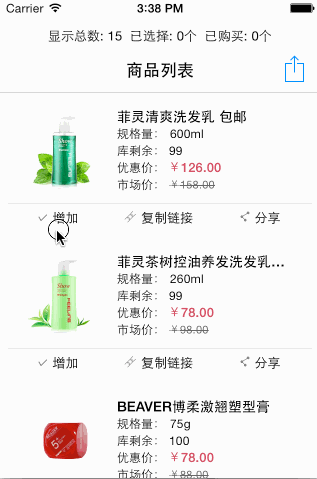

MVVM ARC Demo
============

[](LICENSE.md) 
[](#)
[](#) 

I writing some MVVM and ARC demo. Very conducive to learning.

---

What's MVVM?
-----------

> Model View ViewModel (MVVM) is an architectural pattern for software development.
> MVVM is a variation of Martin Fowler's Presentation Model design pattern. Like Fowler's Presentation Model, MVVM abstracts a view's state and behavior. However, whereas the Presentation Model abstracts a view (i.e., creates a view model) in a manner that does not depend on a specific user-interface platform, MVVM was developed at Microsoft specifically to simplify event-driven programming of user interfaces—by exploiting features of Windows Presentation Foundation (WPF) (Microsoft's .NET graphics system) and Silverlight (WPF's Internet application derivative).
> [more info.](https://en.wikipedia.org/wiki/Model_View_ViewModel#Components_of_the_MVVM_pattern)

What's ARC(ReactiveCocoa)?
--------------------------

> ReactiveCocoa (RAC) is an Objective-C framework inspired by Functional Reactive
Programming. It provides APIs for **composing and transforming streams of
values**.
> [more info.](https://github.com/ReactiveCocoa/ReactiveCocoa)

Demo Indexs
----------
<table width="100%">
    <tr>
        <th>Name</th>
        <th>Description</th>
    </tr>
    <tr>
        <td><a href="#demo-01">Demo 01</a></td>
        <td>An easy level Demo, showing a response calculator.</td>
    </tr>
    <tr>
        <td><a href="#demo-02">Demo 02</a></td>
        <td>This Demo shows how to use MVVM and RAC building with a refreshing and loads more features of the TableView.</td>
    </tr>
</table>

Contents
----------

###Demo 01


`ViewControler.m`
```Objective-C
RAC(_viewModel, leftOperandValue) = self.leftOperandTF.rac_textSignal;
RAC(_viewModel, rightOperandValue) = self.rightOperandTF.rac_textSignal;
RAC(_viewModel, basicOperator) = [self.operationSC rac_newSelectedSegmentIndexChannelWithNilValue:@0];
RAC(self.resultLabel, text) = RACObserve(_viewModel, resultString);
```

`ViewModel.m`
```Objective-C
- (instancetype)init {
    if (self = [super init]) {
        @weakify(self);
        RAC(self, resultString) = [RACSignal combineLatest:@[RACObserve(self, leftOperandValue),RACObserve(self, rightOperandValue), RACObserve(self, basicOperator)] reduce:^id(NSString *v1, NSString *v2){
            @strongify(self);
            if(v1.length > 0 && v2.length > 0) {
                return [self p_calculate];
            } else {
                return nil;
            }
        }];
    }
    return self;
}

- (NSString *)p_calculate {
    NSDecimalNumber *left = [NSDecimalNumber decimalNumberWithString:self.leftOperandValue];
    NSDecimalNumber *right = [NSDecimalNumber decimalNumberWithString:self.rightOperandValue];
    switch (self.basicOperator) {
        case BasicOperatorAdd:
            self.resultString = [left decimalNumberByAdding:right].stringValue;
            break;
        case BasicOperatorSubstract:
            self.resultString = [left decimalNumberBySubtracting:right].stringValue;
            break;
        case BasicOperatorMultiply:
            self.resultString = [left decimalNumberByMultiplyingBy:right].stringValue;
            break;
        case BasicOperatorDivide:
            self.resultString = [left decimalNumberByDividingBy:right].stringValue;
            break;
        default:
            self.resultString = @"未知结果";
    }
    
    return self.resultString;
}
```

###Demo 02



`ViewController.Swift`
```Swift
private func bindData() {
        
        RACObserve(self.viewModel, "needRefreshTableView").ignore(false).deliverOn(RACScheduler.mainThreadScheduler()).subscribeNext { (needRefreshTableView:AnyObject!) -> Void in
            self.tableView.reloadData()
        }
        
        RACObserve(self.viewModel, "isNoMoreData").ignore(false).deliverOn(RACScheduler.mainThreadScheduler()).subscribeNext { (isNoMoreData:AnyObject!) -> Void in
            self.tableView.footer.noticeNoMoreData()
        }
        
        RACObserve(self.viewModel, "isError").ignore(false).deliverOn(RACScheduler.mainThreadScheduler()).subscribeNext { (isError:AnyObject!) -> Void in
            BWMMBProgressHUD.showTitle(kBWMMBProgressHUDLoadErrorMsg, toView: self.view, hideAfter: kBWMMBProgressHUDHideTimeInterval, msgType: .Error)
        }
        
        RACObserve(self.viewModel, "isEndRefreshing").ignore(false).deliverOn(RACScheduler.mainThreadScheduler()).subscribeNext { (isError:AnyObject!) -> Void in
            self.tableView.footer.hidden = false
            self.tableView.header.endRefreshing()
            self.tableView.footer.endRefreshing()
        }
        
        RACObserve(self.viewModel, "isChangePrompt").ignore(false).deliverOn(RACScheduler.mainThreadScheduler()).subscribeNext { (isChangePrompt:AnyObject!) -> Void in
            self.navigationItem.prompt = self.viewModel.prompt
        }
        
    }
```

`ViewModel.swift`
```Swift
    dynamic var needRefreshTableView:Bool = false
    dynamic var isNoMoreData:Bool = false
    dynamic var isError = false
    dynamic var isEndRefreshing = false
    dynamic var isChangePrompt = false
```

Components
----------

* [ReactiveCocoa](https://github.com/ReactiveCocoa/ReactiveCocoa): ReactiveCocoa (RAC) is an Objective-C framework inspired by Functional Reactive Programming.

Feedback
--------

I'd love to hear feedback on the library. Create Github issues, or call my phone `+8615918550637`.

License
----------------

**MVVM ARC Demo** is available under the MIT license. See the LICENSE file for [more info](LICENSE).
